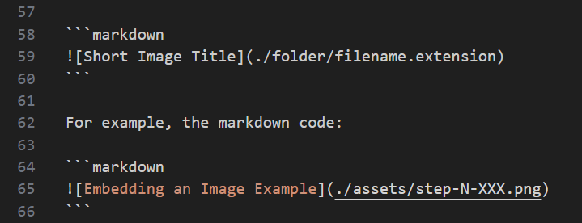
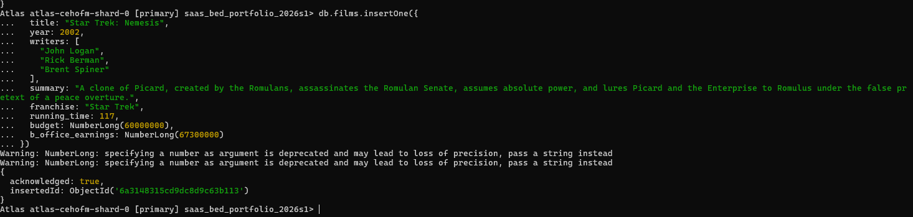

# Answers

## Software as a Service - Back-End Development

#

## Diploma of Information Technology (Advanced Programming)  

#

## Diploma of Information Technology (Back-End Development)

Replace GIVEN_NAME_HERE, FAMILY_NAME_HERE and STUDENT_ID_HERE entries with your details:

| Given Name | Family Name | Student ID  |
|------------|-------------|-------------|
| Anna       | Seed        | x1234567890 |
| Turbat     | Turkhuu     | 20136824    |


# Declaration

I, THE ABOVE NAMED student, by submitting this assessment, I am acknowledging the following:

- The submission is completely my own work.
- I have not used AI in the formuation of the answers within this assessment.
- I have acknowledged all sources of information used in this work (if required).
- I have kept a copy of this assessment (where practicable).
- I understand a copy of my assessment will be kept by TAFE for their records.
- I understand my assessment may be selected for use in the TAFEs validation and audit process to ensure student assessment meets requirements.

When submitting this assessment, I am accepting the above acknowledgement.


---

```table-of-contents
title: # Contents
style: nestedList
minLevel: 0
maxLevel: 3
includeLinks: true
```

---

# How to Answer Questions

Each time you answer a question, fill out the space provided for the answer to the question.

## Answer Requiring an Explanation

Answers to questions should be completed as "block quotes", replacing the `ANSWER_HERE` with the answer, and preceding each line with a greater than sign `>`. To add a new paragraph ensure you leave a `>` with no text after it.

Example:

```markdown
    

## Question Z - How many sofwarte developers does it take to change a lightbulb?
    
    > None. 
	> It is a hardware problem.
```

## Answer Requiring Code

When answering a question that requires code to be included, use a "code block", which starts with three back-ticks (/`) plus the language for the code (e.g. php, js, cpp, python, shell, text, et al).

Example:

```markdown
	

## Question X - Title

	Query Solution:

	```js
	db.collection_name.find();
	```
```

> Note: 
>
> The NoSQL code used to answer the question is contained in a code block,wich opens with three back-ticks (\`\`\`) followed by js, contains the code on the lines below, and ends with three back-ticks (\`\`\`) at the start of the next line after the code. An example is shown above.
> 
> It is important that code blocks start at the beginning of the line for formatting on GitHub, Obsidian or your preferred IDE render the code correctly.

## Answer Requiring Image(s) to Be Inserted

Images are to be saved in a folder called "`assets`" and are embedded into the Markdown document.

Images for this assessment MUST be named in the form `step-X-Ya.ext` where:

- `X` is the step number (e.g. for step 5 the number is `5`)
- `Y` is the question dot number (e.g. for question `2.3` the dot number is `3` )
- `a` is an optional letter to allow for multiple images for an answer.
- `ext` is the filename extension (e.g. `png`, `jpg`, `jpeg`, `svg`, et al)

To insert an image use the following syntax:

```markdown

```

For example, the markdown code:

```markdown

```

Gives:


---


# Step 1: Setting Up for Assessment

This step provides a checklist for yout to ensure you have set up the assessment requirements as needed.


## Checklist

Put an X between each of the pairs of `[ ]` when you have completed the task:

> - [x] Create a new **empty** & **private** repository on GitHub (or the equivalent).
> - [x] Repository is named `xxx-ICT50220-SaaS-2-BED-NoSQL` replacing `xxx` with your initials.
> - [x] Cloned the repository to your local PC.
> - [x] Created a new folder called `assets` inside your cloned repository.
> - [x] Created an empty `ReadMe.md`.
> - [x] Created an empty `.gitignore` file in the assets folder.
> - [x] Downloaded the provided `sample.gitignore` file, moved it into the repository folder, and renamed it to `.gitignore`.
> - [x] Placed a copy of the assessment's Word document into the repository folder.
> - [x] Added all the new files and folders to the repository, commited them to version control, and pushed them to your private remote repository.

---

# Step 2: NoSQL Systems

This step verifies you understand concepts that includes, but is not limited to such as databases, collections, fields, documents and naming conventions.

## 2.1 Defining Terms

Briefly explain what is meant by the terms database, collection, document and field in terms of MongoDB.

> Database is the container that holds many collections. 
> Collection is a group of documents that are stored in the mongdob database. It is similar to tables in a relational 
> database.
> Document is made up of multiple fields and use a structure called BSON that is similar to JSON.
> Field is the typical column in a relational database. In mongodb, fields are key-value pair.
>
> 

## 2.2 NoSQL Database Types

Briefly outline the key features and advantages for TWO of the following NoSQL database types:

- Document Database
- Key-Value Store
- Wide-Column Oriented Database
- Graph Database


## Database Type 1: Document Database

Key Features:
- Stores data in a BSON file structure.
- Flexible schema allows documents in the same collection to have different structures. 
- Supports nested data and complex data types.

Advantages:
- Well suited for semi-structured or unstructured data.
- Flexible schema makes application development faster.


## Database Type 2: Graph Database

Key Features:
- Instead of tables or documents, it uses nodes, edges and properties
- Optimised for traversing and querying connected data
- Supports complex relationship query

Advantages:
- Makes it easy to model and query complex relationships.
- Reduces the need for joins used in relational databases.


## 2.3 NoSQL Database Systems

Provide one example product (commercial or open source) for each of your NoSQL NoSQL Database types.

You may **NOT** include _MongoDB_ which is an example of a _Document Database_.


## Database Type 1: Document Database
> CouchDB

## Database Type 2: Graph Database
> Neo4j


## 2.4 NoSQL Database Uses

Provide an example for each of your NoSQL database of the situation when your database types may provide a benefit when used.

The situations/application of the database types must be different.

## Database Type 1: Document Database
> Online Shopping Platform. There may be thousands of items with different attributes on the platform. The document
> database would allow each document to store different fields without requiring a fixed schema.

## Database Type 2: Graph Database
> Social media platform. A social media application needs to manage relationships between users, friends, followers, 
> posts and groups. A graph database efficiently stores and queries these connections, making features such as friend 
> recommendations faster and more effective.


# Step 3: NoSQL Databases & Collections

## 3.1 Naming Databases, Collections and Fields

What naming convention will you use for the database, collections and fields used in the assessment scenario?

> I will use snake_case

Justify why did you choose this naming convention?

> While there are not set standard set for MongoDB like Pep-8 for Python. On the MongoDB Atlas tutorials, the staff
> were using snake_case for many of the database and collections.

## 3.2 Connecting

- Connect to a running instance of MongoDB (preferred to be your MongoDB Atlas instance).

Add the Connection String used to connect to your MongoDB Atlas instance:

> ```js
> 	mongosh "mongodb+srv://turbat-learning.ooypepa.mongodb.net/" --apiVersion 1 --username Turbat
> ```


#

## 3.3 Database Creation

- Create and use a database named `saas_bed_portfolio_2025s2`.

> ```js
> 	use saas_bed_portfolio_2026s1
> ```

Did you encounter any issues when creating the database? If you did, how did you resolve them?

> ANSWER_HERE


## 3.4 Schema Design for Collection

Using the sample data provided, identify the field types and suitable names for the data storage in a MongoDB database.

In the `notes` column, add any clarifying details (such as rules) that may be useful.

Replace `FIELD_NAME_HERE` and `DATA_TYPE_HERE` in the table below.

> | Item               | Field Name        | MongoDB Data Type | Notes / Rules   |
> |--------------------|-------------------|-------------------|-----------------|
> |                    | FIELD_NAME_HERE   | DATA_TYPE_HERE    |                 |
> | Title              | title             | string            |                 |
> | Year               | year              | int               | four digit year |
> | Writers            | writers           | array             |                 |
> | Summary            | summary           | string            |                 |
> | Franchise          | franchise         | string            |                 |
> | Running Time       | running_time      | int               | minutes         |
> | Budget             | budget            | long              | USD $           |
> | Box Office Takings | b_office_earnings | long              | USD $           |
> | Directors          | directors         | array             |                 |
> | Actors             | actors            | array             |                 |
> |                    |                   | DATA_TYPE_HERE    |                 |
> |                    | FIELD_NAME_HERE   | DATA_TYPE_HERE    |                 |
> |                    | FIELD_NAME_HERE   | DATA_TYPE_HERE    |                 |
> |                    | FIELD_NAME_HERE   | DATA_TYPE_HERE    |                 |


- Provide the schema validation code for the collection.

> ```js
> db.createCollection("films",{
> validator: {
> $jsonSchema: {
>   bsonType: "object",
>   title: "Film object validation",
>   required: ["title", "year", "summary", "running_time"],
>   properties: {
>       title: {
>           bsonType: "string",
>           minLength: 1,
>           maxLength: 200,
>           description: "'title' must be a string and is required. "},
>       year: {
>           bsonType: "int",
>           minimum: 1900,
>           maximum: 2026,
>           description: "'year' must be an integer and have 4 digits"},
>       writers: {
>           bsonType: "array",
>           items: {
>               bsonType: "string",
>           },
>           description: "'writers' must be an array of strings."},
>       summary: {
>           bsonType: "string",
>           minLength: 1,
>           description: "'summary' must be a string."},
>       franchise: {
>           bsonType: "string",
>           description: "'franchise' must be a string"}, 
>       running_time: {
>           bsonType: "int",
>           minimum: 1,
>           description: "'running_time' must be an integer with a positive value."},
>       budget: {
>           bsonType: "long",
>           minimum: 0,
>           description: "'budget' must be a positive integer."},
>       b_office_earnings: {
>           bsonType: "long",
>           minimum: 0,
>           description: "'box_office_earnings' must be a positive integer."},
>       directors: {
>           bsonType: "array",
>           items: {
>               bsonType: "string"
>           },
>           minItems: 1,
>           description: "'directors' must be an array of strings and have at least one value"},
>       actors: {
>           bsonType: "array",
>           items: {
>               bsonType: "string"
>           },
>           minItems: 1,
>           description: "'actors' must be an array of strings and have at least one value"}
> }  
> }
> },
> })
> ```


## 3.5 Collection Creation

- Create a new collection named _films_ and insert the provided data (full statement)

> ```js
> 	CREATE_COLLECTION_IN_MONGODB_ANSWER_HERE
> ```


Screen Shot:




# Step 4: CRUD - Create


## 4.1 Inserting Data

- Add the supplied sample data into the films collection using a **SINGLE** MongoDB Shell COMMAND in the order provided.

Query Solution:

```js
	db.collection_name.find();
```


## 4.2 Inserting Data

From the LMS, download the provided data files, and determine which one you will use to import data into the collection. 

The options are: `film-data-tsv.txt`, `film-data-csv.txt`, and `film-data-json.txt`.

Using the `mongoimport` CLI command, import the data from one of the files to your collection.

What was the complete command you used to perform the import of the provided sample data?

Query Solution:

```js
	db.collection_name.find();
```


## 4.3 Inserting Data

Add the provided additional sample data into the films collection in the order provided.

> You do not have to add any details to the answers.md for this question.


# Step 5: CRUD - Retrieve Queries


## 5.1 Retrieve all documents

- Get all documents from the films collection.

Query Solution:

```js
	db.collection_name.find();
```
	


## 5.2 Retrieve all films written by…

- Get all documents with `writer` set to "`Quentin Tarantino`"

Query Solution:

```js
	db.collection_name.find();
```

Screen Shot:


## 5.3 Retrieve films with actor(s)…

- Get all documents where `actors` include "`Brad Pitt`"

Query Solution:

```js
	db.collection_name.find();
```
	


## 5.4 Retrieve films from a franchise…

- Get all documents with `franchise` set to "`The Hobbit`"

Query Solution:

```js
	db.collection_name.find();
```
	


## 5.5 Retrieve films released in range…

- Get all films released between `1980` and `2020`

Query Solution:

```js
	db.collection_name.find();
```
	
Screen Shot:


## 5.6 Retrieve films longer than…

- Get all films with a running time of over `120` minutes

Query Solution:

```js
	db.collection_name.find();
```


## 5.7 Retrieve films released in range…

- Get all films released after `2022`.

Query Solution:

```js
	db.collection_name.find();
```
	
Screen Shot:


# Step 6: CRUD - Updates

## 6.1 Update document with a synopsis

- Using one or more queries, add the provided synopses to the indicated films.

Query Solution:

```js
	db.collection_name.find();
```
	


## 6.2 Update document with an actor

- Add the provided actors to the required films using one or more queries in the order provided...

Query Solution:

```js
	db.collection_name.find();
```

Screen Shot:


# Step 7: CRUD – Searches

Performing searches on collections.


## 7.1 Searching for titles with …

- Find all films with the `title` starting with "`T`".

Query Solution:

```js
	db.collection_name.find();
```

Screen Shot:


## 7.2 Searching for synopses with …

- Find all films that have a `genre` that contains the letters "`th`"

Query Solution:

```js
	db.collection_name.find();
```

Screen Shot:


## 7.3 Searching for synopses with… and not …

- Find all films that have a `synopsis` that contains the word "`Captain`" and not the word "`Pike`"

Query Solution:

```js
	db.collection_name.find();
```

Screen Shot:


## 7.4 Searching for synopses with … or …

- Find all films that have a `synopsis` that contains the word "`London`" or "`Brooklyn`"

Query Solution:

```js
	db.collection_name.find();
```

Screen Shot:


## 7.5 Searching for synopses with … and …

- Find all films that have a synopsis that contains the words "`team`" and "`search`"

Query Solution:

```js
	db.collection_name.find();
```

Screen Shot:


# Step 8: CRUD - Deletions

This step requires you to remove films from the collection.


## 8.1 Removing a film using its title…

- Use the title to delete the film "`Pee Wee Herman's Big Adventure`"

Query Solution:

```js
	db.collection_name.find();
```

Screen Shot:


## 8.2 Remove a film by ID…

Delete the film “`Fictionally Fake Film`” by:

- Writing a query to discover the film ID
- Then using the found ID to remove the film

Query Solution:

```js
	db.collection_name.find();
```

Screen Shot:


## 8.3 Removing multiple films…

- Delete any films with the exact word “`Fictional`” in their title, ignoring case.

Query Solution:

```js
	db.collection_name.find();
```

Screen Shot:


# Step 9: NoSQL Indexes

Using the films collection, create the indexes to match the following conditions:


## 9.1 Indexes for Sorting

- Create an index on the `title` field.

Query Solution:

```js
	db.collection_name.find();
```


- Create an index on the `year` and `title ` fields.

Query Solution:

```js
	db.collection_name.find();
```

- Create an index on the `franchise`, `title`, `actors`, `year` fields.
- The index must be in the order year, title, actors then franchise.

Query Solution:

```js
	db.collection_name.find();
```


## 9.2 Indexes for Full Text Search

- Create a text index on the `title ` and `summary` fields.

Query Solution:

```js
	db.collection_name.find();
```


## 9.3 Verifying Execution Plans

- Check the execution plan for a query that finds the films with a title containing “Star”. 
- Check if the created index is being used.

Query Solution:

```js
	db.collection_name.find();
```

Screen Shot:


## 9.4 Differences in Indexes

- Briefly explain the differences between an index for sorting against an index for full text searches.
- Include in your answer when each is best suited for use.

> ANSWER_HERE
>
> 


# Step 10: Aggregation

In this step you will be aggregating data within a collection.


## 10.1 Counting documents

- Write an aggregation query to count the number of `Star Trek` films.

Query Solution:

```js
	db.collection_name.find();
```


## 10.2 Mean budget and box office takings…

- Write an aggregation query to calculate the average budget and box office takings.
- Display both values.

Query Solution:

```js
	db.collection_name.find();
```


## 10.3 Profit earnings

- Write an aggregation query to calculate the profit (box office – budget) for the films, showing just the film title and the profit.
- Films with no budget and/or no box office should NOT be included in the results.

Query Solution:

```js
	db.collection_name.find();
```

Screen Shot:


## 10.4 Grouping data

- Write the query to group films by their franchise and count the number of films in each franchise.

Query Solution:

```js
	db.collection_name.find();
```


# Step 11: Triggers

Using the films collection, we are now going to create triggers to provide an audit trail for when data is added, updated or deleted.

## 11.1 Create trigger for inserted data

- Create a trigger that monitors the films collection for new data being added. 

Query Solution:

```js
	db.collection_name.find();
```


## 11.2 Testing the insert trigger works correctly

- Use the following data to check the trigger functions as expected:

Query Solution:

```js
	db.collection_name.find();
```


## 11.3 Create trigger for updated data

- Create a trigger that monitors the films collection for new data being added. 

Query Solution:

```js
	db.collection_name.find();
```

Screen Shot:


## 11.4 Testing the update trigger works correctly

- Use the following data to verify that the trigger functions as expected. Make sure that these updates are completed in more than one query:

Query Solution:

```js
	db.collection_name.find();
```


## 11.5 Create trigger for deleted data

- Create a trigger that monitors the films collection for new data being added. 

Query Solution:

```js
	db.collection_name.find();
```


## 11.6 Testing the delete trigger works correctly

- Use the following conditions to verify that the trigger functions as expected:

Query Solution:

```js
	db.collection_name.find();
```


## 11.7 Verify the log contains data…

- Write a query to show the data in the film audit log.

Query Solution:

```js
	db.collection_name.find();
```

Screen Shot:


# Step 12: Submission

What is the URL for your GitHub (or equivalent) repository for this assessment?

```text
add url here
```

# END
